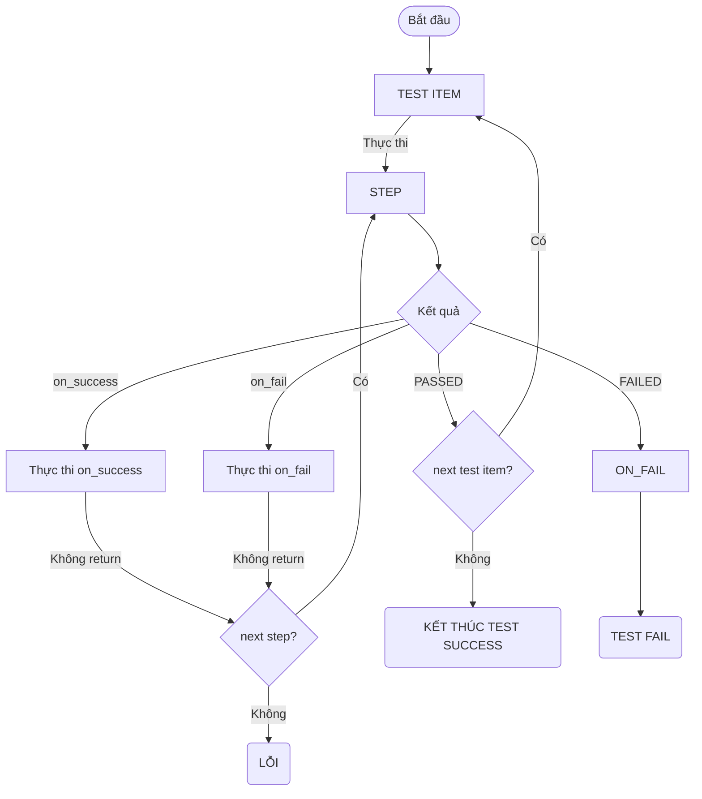

# GIỚI THIỆU
- AUTHOR: <b>Bau.Linh</b>
  
Đây là tài liệu cung cấp thông tin hướng dẫn về `script.yaml`, bao gồm các định dạng, cấu trúc, thành phần, và cách sử dụng các tính năng như String Resolve, Executer & Method, cũng như xử lý lỗi.
---

## THAY ĐỔI & CẬP NHẬT
- Thêm `script_version`, có thể thay đổi version hiển thị chương trình.
- Thêm nhiều executer & method mới. Bổ xung `xử lý lỗi`. Fix sai tên. Cải thiện lại document.
- bổ xung thêm giá trị trả về cho `test_item`. Thêm logic kiểm tra giá trị trả về nằm trong spec không.
- 
## TỔNG QUAN
`script.yaml` là kịch bản tự động hóa được sử dụng cho chương trình <b>ScriptRunner2.exe</b>
Nó cho phép viết các kịch bản test đơn giản đến phức tạp một cách dễ dàng và hiệu quả.

---

## MỤC LỤC

| Phần | Tên                            | Mô Tả                                                  |
| ---- | ------------------------------ | ------------------------------------------------------ |
| 1    | Định Dạng Chung YAML           | Giới thiệu về định dạng chung của file YAML            |
| 2    | Cấu Trúc Chung Cho Script.Yaml | Mô tả cấu trúc cơ bản của file script.yaml             |
| 3    | Thành Phần                     | Giải thích các thành phần chính trong script.yaml      |
| 4    | String Resolve                 | Hướng dẫn sử dụng tính năng String Resolve             |
| 5    | Executer & Method              | Hướng dẫn sử dụng Executer và Method trong script.yaml |
| 6    | Xử Lý Lỗi                      | Hướng dẫn cách xử lý lỗi                               |
| 7    | Ví dụ và hướng dẫn             | Ví dụ và hướng dẫn.                                    |

---

##  1. ĐỊNH DẠNG CHUNG YAML
**🚨 CHÚ Ý**:
- Sử dụng dấu cách ` ` để thụt lề, không sử dụng tab.
- Sử dụng dấu gạch ngang `-` để liệt kê các mục trong danh sách.
- Sử dụng dấu hai chấm `:` để phân tách khóa và giá trị.
- Sử dụng dấu ngoặc kép ("") hoặc dấu nháy đơn ('') cho các chuỗi có chứa ký tự đặc biệt.
- Các khóa `key` viết dạng `lower_case_with_underscores`.

---

## 2. CẤU TRÚC CHUNG CHO SCRIPT.YAML
```yaml
script:
  mes_defect_code: ~
  test_environments: ~ 
  test_configurations: ~
  test_sequences: ~
  test_targets: ~ 
```

<b>Hướng dẫn:</b>

- `script.yaml` bao gồm một khoá chính `script`, bên trong có các khoá con như sau:
  - `mes_defect_code`: Danh sách mã lỗi MES.
  - `test_environments`: Các môi trường tải xuống từ SFTP.
  - `test_configurations`: Cấu hình test cho các thiết bị.
  - `test_sequences`: Các bước kiểm tra cụ thể.
  - `test_targets`: Các mục tiêu kiểm tra với các model khác nhau.

---

## 3. THÀNH PHẦN


### `mes_defect_code`
- <b>Mô tả:</b> Danh sách mã lỗi MES cung cấp.
- <b>Type:</b> Mapping (string-string)
- <b>Ví dụ:</b>
  
```yaml
mes_defect_code:
  <eror_name>: <defect_code> # error_name: tên lỗi của chương trình, defect_code: mã lỗi MES tương ứng
  ERROR_001: OS01
  ERROR_002: OS02
```

### `test_environments`
- <b>Mô tả:</b> Các môi trường tải xuống từ SFTP.
- <b>Type:</b> danh sách object
- <b>Ví dụ:</b>
```yaml
test_environments: 
- &env
  # những item sẽ được tải xuống.
  # là 1 danh sách object có các trường: name, type, from,  to, extract_to
  # có thể dùng &<name> để tham chiếu
  downloads:
    - name: "vtp" 
      # name: tên hiển thị của item tải về, không ảnh hưởng đến quá trình tải
      type: "folder" # loại tải về: folder, file, compressed
      # type có thể là: folder, file, compressed
      from: "/SFTP.conf.pe.02/V6ENV/vtp_ver24011801" 
      # from: đường dẫn trên server sftp, có thể tuyệt đối hoặc tương đối
      # tuyệt đối dạng: /SFTP.conf.pe.02/V6ENV/vtp_ver24011801
      # tương đối dạng: ./setup/vtp_ver24011801
      # kỹ sư EE sẽ tự verify đường dẫn này trên server sftp.
      to: "./setup/vtp" # đường dẫn lưu trữ trên máy local
      # to: đường dẫn lưu trữ trên máy local. Có thể sử dụng tuyệt đối hoặc tương đối
      # tương đối sẽ lưu vào: {thư mục exe}/setup/{PRODUCT}/{STATION}/{MODEL_ID}/{đường dẫn tương đối}
      extract_to: ~
      # dành cho file nén (compressed).
      # để là null (~). Giải nén vào ./setup/{tên file}
      # đường dẫn tương đối
      # đường dẫn tuyệt đối

  # ví dụ item thứ 2.
  - name: "vtp_env" #  thư mục vtp chỉ chứa file vtp, môi trường vtp nên configure riêng theo từng model
    type: "folder" 
    from: "./setup/VN6301ABAR0B" # đường dẫn tương đối
    to: "./setup/vtp" # đường dẫn lưu trữ trên máy local
    extract_to: ~
```
 
**Cấu trúc chi tiết của `test_environments`:**
| key                 | kiểu dữ liệu     | bắt buộc | cho phép null không | mô tả                                           |
| ------------------- | ---------------- | -------- | ------------------- | ----------------------------------------------- |
| `test_environments` | danh sách object | không    | không               | danh sách các môi trường tải xuống từ SFTP      |
| `downloads`         | danh sách object | không    | không               | danh sách các mục tải về trong môi trường       |
| `name`              | string           | có       | không               | tên hiển thị của mục tải về                     |
| `type`              | string           | có       | không               | loại mục tải về: `folder`, `file`, `compressed` |
| `from`              | string           | có       | không               | đường dẫn trên server SFTP                      |
| `to`                | string           | có       | không               | đường dẫn lưu trữ trên máy local                |
| `extract_to`        | string           | không    | có                  | đường dẫn giải nén cho file nén (compressed)    |

**Bổ xung:**
- Sử dụng `&<name>` để đặt tên cho môi trường.
- `downloads`: về mặt logic, nếu có item này thì phải có ít nhất 1 mục tải về bên trong.
- `name`: tên hiển thị, không ảnh hưởng đến quá trình tải.
- `type`: loại tải về, <b>CHỈ</b>có thể là `folder`, `file`, hoặc `compressed`.
- `from`: đường dẫn trên server SFTP, có thể là tuyệt đối hoặc tương đối.
  - Tuyệt đối, ví dụ: `/SFTP.conf.pe.02/V6ENV/vtp_ver24011801`
  - Tương đối, ví dụ: `./setup/abc`, tương đương: `/SFTP.conf.pe.02/V6/{PRODUC}/{STATION}/setup/abc`
- `to`: đường dẫn lưu trữ trên máy local, có thể là tuyệt đối hoặc tương đối.
  - Tuyệt đối: ví dụ: `D:\Downloads\setup\vtp`, sử dụng `\`.
  - Tương đối: ví dụ: `./setup/vtp`, tương đương: `{thư mục exe}/setup/{PRODUCT}/{STATION}/{MODEL_ID}/setup/vtp`
- `extract_to`: chỉ dành cho `type: compressed`.
  - Nếu để null (~), sẽ giải nén vào `./setup/{tên file}`.
  - Có thể sử dụng đường dẫn tương đối hoặc tuyệt đối.

**Các môi trường đã được setup và có thể dùng chung**:

| Tên môi trường         | Đường dẫn                                  | Mô tả                                                                                                              |
| ---------------------- | ------------------------------------------ | ------------------------------------------------------------------------------------------------------------------ |
| adb                    | `/SFTP.conf.pe.02/V6ENV/adb`               | Công cụ adb cho việc giao tiếp với thiết bị Android.                                                               |
| AtmelSecureAccess tool | `/SFTP.conf.pe.02/V6ENV/AtmelSecureAccess` | Thư viện và công cụ Atmel Secure Access. Dành cho trạm UX100, UX110 OS DL                                          |
| QFIL                   | `/SFTP.conf.pe.02/V6ENV/qfil_env`          | Công cụ QFIL để flash os image cho thiết bị Android.                                                               |
| OCR                    | `/SFTP.conf.pe.02/V6ENV/tessdata`          | Thư viện ngôn ngữ cho OCR Tesserect. Dành cho các trạm dùng CAMERA VISION                                          |
| vtp                    | `/SFTP.conf.pe.02/V6ENV/vtp_ver24011801`   | Chứa tool VTP.exe của khách hàng. Yêu cầu: Cần phải setup thêm môi trường riêng cho từng model (xem ví dụ ở dưới). |
| jlink                  | `/SFTP.conf.pe.02/V6ENV/jlink_env`         | Công cụ JLink để nạp firmware.                                                                                     |
| icimei_tool            | `/SFTP.conf.pe.02/V6ENV/icimei_tool`       | Công cụ ghi imei vào sản phẩm.                                                                                     |


### `test_configurations`
- <b>Mô tả:</b> Cấu hình test cho từng script, từng slot.
- <b>Type:</b> danh sách object
- <b>Ví dụ:</b>
```yaml
script:
  test_configurations: 
  - &t650c_configuration
    flags: ~ 
    script_information: 
      station_name: <tên trạm> # bắt buộc
      description: <mô tả> # bắt buộc
      script_version: "1.0.0.0" # phiên bản hiển thị
    script_configuration: 
      general: # key-value (string-string), có thể null
      working_dir: "C:\\Test\\T650C"
    fixture_configuration: # danh sách object, có thể null
      - fixture_1:  # danh sách key-value
        port: "COM3"
        baud_rate: "9600"
      - fixture_2:
        port: "COM4"
        baud_rate: "115200"
```

**Cấu trúc chi tiết của `test_configurations`:**
| key                     | kiểu dữ liệu            | bắt buộc | cho phép null không | mô tả                                        |
| ----------------------- | ----------------------- | -------- | ------------------- | -------------------------------------------- |
| `test_configurations`   | danh sách object        | có       | không               | danh sách các cấu hình test                  |
| `flags`                 | danh sách `string`      | không    | có                  | các cờ tùy chọn cho cấu hình test            |
| `script_information`    | object                  | có       | không               | thông tin về kịch bản test                   |
| `station_name`          | string                  | có       | không               | tên trạm kiểm tra                            |
| `description`           | string                  | có       | không               | mô tả kịch bản test                          |
| `script_version`        | string                  | có       | không               | phiên bản hiển thị của kịch bản test         |
| `script_configuration`  | object                  | có       | không               | cấu hình chi tiết cho kịch bản test          |
| `general`               | mapping (string-string) | không    | có                  | cấu hình chung cho kịch bản test             |
| `fixture_configuration` | danh sách object        | không    | có                  | cấu hình cho các thiết bị kiểm tra (fixture) |

**Bổ xung:**
- Sử dụng `&<name>` để đặt tên cho cấu hình test.
- `flags`: danh sách các cờ tùy chọn, có thể để null.
- các object bên trong `fixture_configuration` có thể có nhiều trường key-value tùy theo từng yêu cầu của kịch bản test. Nhưng <b>PHẢI</b> đồng nhất về cấu trúc giữa các object trong cùng một `fixture_configuration`.

**Các flags có thể sử dụng:**
| Tên cờ                    | Mô tả                                                  |
| ------------------------- | ------------------------------------------------------ |
| `enable_camera_window`    | Mở cửa sổ dành cho camera. Dùng cho trạm CAMERA VISION |
| `skip_upload_defect_code` | Bỏ qua bước upload mã lỗi lên MES nếu test FAIL.       |
| `fixture_control`         | Gửi mã fixture_code lên MES.                           |


### `test_targets`
- <b>Mô tả:</b> Configure các `script` tương ứng với các `MODEL_ID` khác nhau.
- <b>Type:</b> danh sách object
- <b>Ví dụ:</b>
```yaml
test_targets: 
  - model_id: VN6503ABMX0B | VN6503ABMX01 
    environment: *env_saa
    test_config: *t650_saa
    test_sequence: *t650c_test_sequence
  - model_id: VN6503ABMX0C
    environment: *env_naa
    test_config: *t650_naa
    test_sequence: *t650c_test_sequence
```
**Cấu trúc chi tiết của `test_targets`:**

| key             | kiểu dữ liệu     | bắt buộc | cho phép null không | mô tả                                                                  |
| --------------- | ---------------- | -------- | ------------------- | ---------------------------------------------------------------------- |
| `test_targets`  | danh sách object | có       | không               | danh sách các mục tiêu kiểm tra                                        |
| `model_id`      | string           | có       | không               | danh sách các model ID, cách nhau bằng dấu dấu gạch dọc                |
| `environment`   | reference        | có       | có                  | tham chiếu đến môi trường test đã định nghĩa trong `test_environments` |
| `test_config`   | reference        | có       | không               | tham chiếu đến cấu hình test đã định nghĩa trong `test_configurations` |
| `test_sequence` | reference        | có       | không               | tham chiếu đến kịch bản test đã định nghĩa trong `test_sequences`      |

**Bổ xung:**
- `model_id`: có thể liệt kê nhiều model ID trong cùng một mục tiêu kiểm tra, cách nhau bằng dấu gạch dọc (|).
- `environment`, `test_config`, `test_sequence`: sử dụng tham chiếu đến các thành phần đã định nghĩa trước đó bằng cách sử dụng `*<name>`.  Có thể sử dụng null (~) cho `environment` nếu không cần môi trường đặc biệt.
- Mục tiêu kiểm tra cho phép cấu hình riêng biệt cho từng model ID hoặc nhóm model ID. Có thể sử dụng chung các `test_configurations` và `test_sequences` nếu chúng giống nhau giữa các model.


### `test_sequences`
- <b>Mô tả:</b> Chứa danh sách các kịch bản cụ thể, mỗi kịch bản là một danh sách `test_item`, mỗi `test_item` có các bước test cụ thể.
- <b>Type:</b> danh sách object
- <b>Ví dụ:</b>
```yaml
test_sequences: 
  - &t650c_test_sequence
    test_items:
    - name: CHECK_MBS_NO 
      lower_limit: ~ 
      upper_limit: ~ 
      steps: 
        - do: mes.CHECK_MBS_NO 
          with: ~
          on_success: ~
           on_fail: ~

    - name: MES_GET_ETH_MAC
      steps: 
        - do: mes.GET_MAC_LIST
          with: ~
          on_success: ~
          on_fail: ~

    - name: PMS_AUTO_TEST
      steps: 
        - do: pms.AUTO
          with:
            working_path: C:\\T650C_SA_K81DL_TOOL20230929\\V1.21.2\PMS_Simulation_Window_V1.09
            exe_name: PMS_Simulation_Window_V1.09.exe
            bt_mac: ~
            wifi_mac: ~
            eth_mac: 123456789012 
          on_success: ~
          on_fail: ~

    - name: MT_AUTO_TEST
      steps: 
        - do: mt.AUTO
          with: 
          working_path: C:\T650C_SA_K81DL_TOOL20230929\V1.21.2
          exe_name: PCBA_tests.exe
          ict_sn_01: $context input_str
          ict_sn_02: ~
        on_success: ~
        on_fail: ~
    
    - name: CHECK_RESULT
      steps: 
        - do: mt.check_tasklist
          with: 
            board_id: 01
            expect: K81-Firmware,Complete
          on_success: ~ 
          on_fail: 
            - do: return.FAIL
              with:
                error_code: DOWNLOAD_K81_FIRMWARE_FAIL
    
    - do: mt.check_tasklist
      with: 
        board_id: 01
        expect: K81-APP,Complete
      on_success: 
        - do: return.PASS
          with: ~
      on_fail: 
        - do: return.FAIL
          with:
            error_code: DOWNLOAD_K81_APP_FAIL
```
**Cấu trúc chi tiết của `test_sequences`:**
| key              | kiểu dữ liệu            | bắt buộc | cho phép null không | mô tả                                           |
| ---------------- | ----------------------- | -------- | ------------------- | ----------------------------------------------- |
| `test_sequences` | danh sách object        | có       | không               | danh sách các kịch bản test                     |
| `test_items`     | danh sách object        | có       | không               | danh sách các mục kiểm tra trong kịch bản       |
| `name`           | string                  | có       | không               | tên của mục kiểm tra                            |
| `lower_limit`    | string                  | không    | có                  | giới hạn dưới cho mục kiểm tra                  |
| `upper_limit`    | string                  | không    | có                  | giới hạn trên cho mục kiểm tra                  |
| `steps`          | danh sách object        | có       | không               | danh sách các bước thực hiện trong mục kiểm tra |
| `do`             | string                  | có       | không               | hành động cần thực hiện                         |
| `with`           | mapping (string-string) | không    | có                  | tham số truyền vào cho hành động                |
| `on_success`     | danh sách object        | không    | có                  | các hành động khi bước thực hiện thành công     |
| `on_fail`        | danh sách object        | không    | có                  | các hành động khi bước thực hiện thất bại       |

**Bổ xung:**
- Sử dụng `&<name>` để đặt tên cho kịch bản test.
- `test_items`: mỗi mục kiểm tra có thể có tên, giới hạn dưới và trên, cùng với các bước thực hiện.
- `do`: cấu trúc của hành động, định dạng là `<executer>.<method>`.
- `with`: tham số truyền vào cho hành động, có thể để null. Hoặc danh sách key-value (string, string) tùy theo `method`.
- `on_success`: khi hành động thành công, sẽ thực hiện các hành động bên trong danh sách này. Nếu để null (~) thì sẽ tiếp tục <b>THỰC HIỆN HÀNH ĐỘNG TIẾP THEO TRONG DANH SÁCH TEST ITEMS, NẾU KHÔNG CÒN HÀNH ĐỘNG NÀO THÌ SẼ BÁO LỖI.</b>
- `on_fail`: khi hành động thất bại, sẽ thực hiện các hành động bên trong danh sách này. Nếu để null (~) thì sẽ tiếp tục <b>THỰC HIỆN HÀNH ĐỘNG TIẾP THEO TRONG DANH SÁCH TEST ITEMS, NẾU KHÔNG CÒN HÀNH ĐỘNG NÀO THÌ SẼ BÁO LỖI.</b>

**Sơ đồ logic thực hiện test_sequences:**


---

## 4. STRING RESOLVE
- <b>Mô tả:</b> Cung cấp các biến động để sử dụng trong `with`. Cú pháp sử dụng là: `$<key> <value>`
- <b>Ví dụ:</b>
```yaml
- do: logger.info
  with:
    message: $str người dùng đã nhập MBSNO là {$context input_str}
```

**Các biến động có thể sử dụng:**
| Dạng                                          | Mô tả                                                                                                                                                                                   |
| --------------------------------------------- | --------------------------------------------------------------------------------------------------------------------------------------------------------------------------------------- |
| `$context input_str`                          | Lấy giá trị `MBSNO`.                                                                                                                                                                    |
| `$context <key>`                              | Lấy giá trị biến `key` hiện tại.                                                                                                                                                        |
| `$script_config <key>`                        | Lấy giá trị `key` từ `script_configuration` trong `test_configurations`.                                                                                                                |
| `$user_config mes_on`                         | Lấy chế độ chương trình hiện tại. `True`: PRODUCTION MODE, `False`: OFFLINE MODE.                                                                                                       |
| `$if <condition> <toán tử> <giá trị>`         | Biểu thức điều kiện if. Trả về True hoặc False. Xem ví dụ bên dưới.                                                                                                                     |
| `$path <relative_path>`                       | Lấy đường dẫn tuyệt đối từ đường dẫn tương đối. Ví dụ: `$path ./setup/vtp` sẽ trả về `D:\TestRunner\setup\{PRODUCT}\{STATION}\{MODEL_ID}\setup\vtp` nếu thư mục exe là `D:\TestRunner`. |
| `$func <function_name> <param1> <param2> ...` | Gọi hàm tùy chỉnh đã được định nghĩa trong chương trình. Hàm đang được phát triển.                                                                                                      |
| `$str <text>`                                 | Trả về chuỗi text. Dùng để nối chuỗi động.                                                                                                                                              |

**Bổ xung**:
- Biểu thức điều kiện if:
  - Cú pháp: `$if <condition> <toán tử> <giá trị>`
  - `<condition>`: có thể là biến động như `$context input_str`, `$script_config working_dir`, v.v.
  - `<toán tử>`: bao gồm `==`, `!=`, `>`, `<`, `>=`, `<=`.
  - `<giá trị>`: giá trị so sánh, có thể là chuỗi hoặc số.
  - Ví dụ:
 ```yaml
 - do: logger.info
   with:
     message: $if {$context input_str} == 123456 # => message: True nếu input_str là 123456, ngược lại: message: False
 ```

  - Hỗ trợ lồng nhiều biểu thức với nhau, mỗi biểu thức con được bọc trong `{ biểu thức }` . Ví dụ:
 ```yaml
  - do: logger.info
    with:
      message: $str Giá trị imei là { $context MES[imei] }
 ```

---

## 5. EXECUTER & METHOD
### Mô tả chung
<b>Mô tả:</b> Cung cấp thông tin về các `executer`, `method` và `with` tương ứng có thể sử dụng trong `do`.
<b>Ví dụ:</b>
```yaml
- do: mes.CHECK_MBS_NO
  with: ~
```
**BỔ XUNG - CHÚ Ý**:
- `method` với tên `UPPER_CASE_WITH_UNDERSCORES` là `method` sẽ return về `PASS` hoặc `FAIL`. Các `step` tiếp theo trong cùng `test_item` sẽ bị bỏ qua.
- `method` với tên `lower_case_with_underscores` là `method` không return về `PASS` hoặc `FAIL`. Tùy thuộc kết quả thực thi `method` mà nó sẽ thực hiện `on_success` hoặc `on_fail`. **TUY NHIÊN**, nếu nó xảy ra lỗi thì cũng sẽ return về `FAIL` mà không thực hiện `on_fail`.
- `on_success`, `on_fail` nếu là `~` (null) thì sẽ tiếp tục thực hiện `step` tiếp theo trong cùng `test_item`. Nếu không còn `step` nào thì sẽ báo lỗi. Vì vậ ITEM CUỐI CÙNG CẦN PHẢI CÓ `return.PASS`.

### Bảng Executer & Method hỗ trợ

| Executer                                    | Method                              | with                                                                                                                                                                                                                                                                                                 | Kết quả        | Mô tả                                                                                                                                                                                                     | Chú ý                                                                                                                                                                                                                                                                                 |
| ------------------------------------------- | ----------------------------------- | ---------------------------------------------------------------------------------------------------------------------------------------------------------------------------------------------------------------------------------------------------------------------------------------------------- | -------------- | --------------------------------------------------------------------------------------------------------------------------------------------------------------------------------------------------------- | ------------------------------------------------------------------------------------------------------------------------------------------------------------------------------------------------------------------------------------------------------------------------------------- |
| `return` - điều khiển kết quả test          | `return.PASS`                       | `test_item_value: <giá trị, có thể bỏ qua>`                                                                                                                                                                                                                                                          | `PASS`         | Dùng để kết thúc `test_item` với kết quả `PASS`. Bỏ qua các bước tiếp theo trong `test_item`.                                                                                                             | - Nếu `test_item` có `lower_limit` hoặc `upper_limit` là số, sẽ tự check `test_item_value` với limit, nếu quá limit sẽ trả về `<tên item>_TO_LOW` hoặc `<tên item>_TO_HIGH`                                                                                                           |
|                                             | `return.FAIL`                       | - `error_code: <tên lỗi>` <br> - `more_infomation: <chi tiết, có thể bỏ qua>` <br> - `test_item_value: <giá trị trả về, có thể bỏ qua>`                                                                                                                                                              | `FAIL`         | Dùng để kết thúc `test_item` với kết quả `FAIL` và ghi mã lỗi. Bỏ qua các bước tiếp theo trong `test_item`.                                                                                               | Mã lỗi nên đề là `UPPER_CASE_WITH_UNDERSCORES`.                                                                                                                                                                                                                                       |
| `mes` - giao tiếp với MES                   | `mes.is_online`                     | `~`                                                                                                                                                                                                                                                                                                  | `true` `false` | Trả về `on_success` nếu chương trình chạy mode PRODUCTION, và ngược lại.                                                                                                                                  | -                                                                                                                                                                                                                                                                                     |
|                                             | `mes.CHECK_MBS_NO`                  | `~`                                                                                                                                                                                                                                                                                                  | `PASS` `FAIL`  | Kiểm tra đầu vào MBSNO. Mọi trạm test qua MES đều cần.                                                                                                                                                    | Nếu chế độ là OFFLINE => trả về PASS.                                                                                                                                                                                                                                                 |
|                                             | `mes.GET_CSN`                       | `~`                                                                                                                                                                                                                                                                                                  | `PASS` `FAIL`  | Lấy giá trị CSN của MBSNO từ MES và lưu vào `context` với tên `MES[csn]`                                                                                                                                  | Chế độ OFFLINE sẽ lỗi                                                                                                                                                                                                                                                                 |
|                                             | `mes.GET_CONTROL_TABLE`             | `~`                                                                                                                                                                                                                                                                                                  | `PASS` `FAIL`  | Lấy thông tin guankongbiao từ MES và lưu vào `context` lần lượt với tên `MES[<tên biến>]`                                                                                                                 | Chế độ OFFLINE sẽ lỗi. Liên hệ với MES để lấy các trường thông tin cần thiết.                                                                                                                                                                                                         |
|                                             | `mes.GET_PTID`                      | `~`                                                                                                                                                                                                                                                                                                  | `PASS` `FAIL`  | Lấy PTID theo MBSNO                                                                                                                                                                                       | Chế độ OFFLINE sẽ lỗi. Dành cho các trạm cần lấy thông tin PTID.                                                                                                                                                                                                                      |
|                                             | `mes.GET_MAC_LIST`                  | `~`                                                                                                                                                                                                                                                                                                  | `PASS` `FAIL`  | Lấy một MAC mới hoặc MAC đã được ghép với MBSNO từ MES và lưu vào `context` với tên `MES[mac]`                                                                                                            | Chế độ OFFLINE sẽ lỗi. Dành cho các trạm cần ghi `BT MAC`, `WIFI MAC`, hoặc `ETH MAC` mà cần lấy MAC mới từ MES.                                                                                                                                                                      |
|                                             | `mes.GET_MAC_LIST_EX`               | `~`                                                                                                                                                                                                                                                                                                  | `PASS` `FAIL`  | Lấy danh sách MAC và lưu vào context. Cần liên hệ MES để có thể lấy được MAC.                                                                                                                             | Chế độ OFFLINE sẽ lỗi. Dành cho các trạm cần ghi `BT MAC`, `WIFI MAC`, hoặc `ETH MAC` mà cần lấy MAC mới từ MES.                                                                                                                                                                      |
|                                             | `mes.GET_VARIABLES_BY_STATION_JSON` | `~`                                                                                                                                                                                                                                                                                                  | `PASS` `FAIL`  | Lấy các biến MES cung cấp xuống. Thường sẽ dùng cái này để lấy `imei`                                                                                                                                     | Chế độ OFFLINE sẽ lỗi. Dành cho các trạm cần ghi `BT MAC`, `WIFI MAC`, hoặc `ETH MAC` mà cần lấy MAC mới từ MES.                                                                                                                                                                      |
|                                             | `mes.GET_NEW_IMEI`                  | `~`                                                                                                                                                                                                                                                                                                  | `PASS` `FAIL`  | Lấy một IMEI mới từ MES và lưu vào `context` với tên `MES[imei]`                                                                                                                                          | Chế độ OFFLINE sẽ lỗi. Dành cho các trạm cần ghi IMEI mới lấy từ MES.                                                                                                                                                                                                                 |
|                                             | `mes.UPLOAD_BT_MAC`                 | - `mac: <MAC>`                                                                                                                                                                                                                                                                                       | `PASS` `FAIL`  | Upload BT MAC đã ghi lên MES.                                                                                                                                                                             | Chế độ OFFLINE sẽ lỗi. Dành cho các trạm cần upload BT MAC lên MES. `<MAC>` đã được đọc và lưu vào `context` ở item trước đó.                                                                                                                                                         |
|                                             | `mes.UPLOAD_WIFI_MAC`               | - `mac: <MAC>`                                                                                                                                                                                                                                                                                       | `PASS` `FAIL`  | Upload WIFI MAC đã ghi lên MES.                                                                                                                                                                           | Chế độ OFFLINE sẽ lỗi. Dành cho các trạm cần upload WIFI MAC lên MES. `<MAC>` đã được đọc và lưu vào `context` ở item trước đó.                                                                                                                                                       |
|                                             | `mes.UPLOAD_ETH_MAC`                | - `mac: <MAC>`                                                                                                                                                                                                                                                                                       | `PASS` `FAIL`  | Upload ETH MAC đã ghi lên MES.                                                                                                                                                                            | Chế độ OFFLINE sẽ lỗi. Dành cho các trạm cần upload ETH MAC lên MES. `<MAC>` đã được đọc và lưu vào `context` ở item trước đó.                                                                                                                                                        |
| `logger` - ghi log                          | `logger.info`                       | - `message: <chuỗi>`                                                                                                                                                                                                                                                                                 | `true`         | Ghi một thông điệp ở mức INFO vào log.                                                                                                                                                                    | `<chuỗi>` có thể là chuỗi tĩnh hoặc sử dụng String Resolve để tạo chuỗi động.                                                                                                                                                                                                         |
| `com` - đọc/gửi lệnh qua <b>SERIAL PORT</b> | `com.open`                          | - `name: <tên định danh>` <br> - `port: <tên cổng>` <br> - `baudrate: <tốc độ baud>`                                                                                                                                                                                                                 | `true`         | Mở kết nối đến cổng COM.                                                                                                                                                                                  | `<tên định danh>` dùng để tham chiếu cổng COM này trong các lệnh tiếp theo.                                                                                                                                                                                                           |
|                                             | `com.close`                         | - `name: <tên định danh>`                                                                                                                                                                                                                                                                            | `true`         | Đóng kết nối đến cổng COM.                                                                                                                                                                                | - Chương trình sẽ tự đóng cổng COM tự động. Cần dùng khi cần kiểm soát đóng cổng COM để thực hiện lệnh tiếp theo.                                                                                                                                                                     |
|                                             | `com.wait_bytes_count`              | - `name: <tên định danh>` <br> - `expect_count: <số byte>` <br> - `timeout: <thời gian chờ (s)>`                                                                                                                                                                                                     | `true` `false` | Chờ đến khi có đủ số byte nhận được từ cổng COM.                                                                                                                                                          | Trả về `false` nếu vượt quá thời gian chờ.                                                                                                                                                                                                                                            |
|                                             | `com.wait_string`                   | - `name: <tên định danh>` <br> - `expect: <chuỗi mong đợi>` <br> - `timeout: <thời gian chờ (s)>`                                                                                                                                                                                                    | `true` `false` | Chờ đến khi nhận được chuỗi mong đợi từ cổng COM.                                                                                                                                                         | - Trả về `false` nếu vượt quá thời gian chờ. <br> - `expect`: dùng chuỗi string hoặc `re_<expression>` để khớp với một biểu thức chính quy.                                                                                                                                           |
|                                             | `com.send_string`                   | - `name: <tên định danh>` <br> - `command: <chuỗi gửi>` <br> - `sleep: <thời gian delay sau khi gửi (s)>`                                                                                                                                                                                            | `true`         | Gửi một chuỗi đến cổng COM.                                                                                                                                                                               | - Gửi enter bằng cách sử dụng `\r\n`                                                                                                                                                                                                                                                  |
|                                             | `com.send_wait`                     | - `name: <tên định danh>` <br> - `command: <chuỗi gửi>` <br> - `retry_times: <số lần retry`> <br> - `expect: <chuỗi mong đợi>` <br> - `timeout: <thời gian chờ (s)>`                                                                                                                                 | `true` `false` | Gửi một chuỗi đến cổng COM và chờ phản hồi mong đợi.                                                                                                                                                      | - Trả về `false` nếu không thành công. <br> - `expect`: dùng chuỗi string hoặc `re_<expression>` để khớp với một biểu thức chính quy.                                                                                                                                                 |
|                                             | `com.check_log`                     | - `name: <tên định danh>` <br> - `expect: <chuỗi mong đợi>`                                                                                                                                                                                                                                          | `true` `false` | Kiểm tra xem chuỗi mong đợi có xuất hiện trong log nhận được từ cổng COM hay không.                                                                                                                       | - Trả về `false` nếu không tìm thấy. <br> - `expect`: dùng chuỗi string hoặc `re_<expression>` để khớp với một biểu thức chính quy.                                                                                                                                                   |
|                                             | `com.read_value`                    | - `name: <tên định danh>` <br> - `expect: <chuỗi mong đợi>` <br> - `match_index: <index của chỗi match cần lấy>` <br> - `replace: <chuỗi cần thay thế>` <br> `replace_with: <giá trị thay thế>` <br>  - `var_name: <tên biến lưu giá trị>`                                                           | `true` `false` | Đọc một giá trị từ log nhận được và lưu vào `context`.                                                                                                                                                    | - Trả về `false` nếu không tìm thấy. <br> - `expect`: dùng chuỗi string hoặc `re_<expression>` để khớp với một biểu thức chính quy. <br> - `index`: vị trí nhóm cần lấy <br> - `replace`: dùng trực tiếp regex <br> - `replace_with`: dùng chuỗi string <br>                          |
|                                             | `com.wait_check`                    | - `name: <tên định danh>` <br> - `expect_wait: <chuỗi mong đợi>` <br> - `expect_check: <chuỗi kiểm tra>` <br> `timeout: <thời gian chờ (s)>`                                                                                                                                                         | `true` `false` | Chờ đến khi nhận được chuỗi mong đợi và kiểm tra chuỗi kiểm tra có xuất hiện trong log hay không.                                                                                                         | - Trả về `false` nếu không thành công. <br> - `expect_wait`, `expect_check`: dùng chuỗi string hoặc `re_<expression>` để khớp với một biểu thức chính quy.                                                                                                                            |
|                                             | `com.clear_log `                    | - `name: <tên định danh>` <br> -                                                                                                                                                                                                                                                                     | `true`         | - Xóa log tạm của com hiện tại. Thường dùng với `read_value`, `check_log` phía trên.                                                                                                                      |                                                                                                                                                                                                                                                                                       |
| `dialog` - hiển thị hộp thoại               | `dialog.show`                       | - `title: <tiêu đề>` <br> - `message: <nội dung>` <br>                                                                                                                                                                                                                                               | `true`         | Hiển thị một hộp thoại thông báo và chờ xác nhận OK.                                                                                                                                                      |                                                                                                                                                                                                                                                                                       |
|                                             | `dialog.confirm`                    | - `title: <tiêu đề>` <br> - `message: <nội dung>`                                                                                                                                                                                                                                                    | `true` `false` | Hiển thị một hộp thoại xác nhận và chờ người dùng chọn `YES/OK` hoặc `No/Cancel`.                                                                                                                         |                                                                                                                                                                                                                                                                                       |
|                                             | `dialog.input`                      | - `title: <tiêu đề>` <br> - `message: <nội dung>` <br> - `var_name: <tên biến lưu giá trị>`                                                                                                                                                                                                          | `true`         | Hiển thị một hộp thoại nhập liệu và lưu giá trị nhập vào vào `context`.                                                                                                                                   |                                                                                                                                                                                                                                                                                       |
| `func` - các hàm chức năng khác             | `func.sleep`                        | - `time: <thời gian (s)>`                                                                                                                                                                                                                                                                            | `true`         | Tạm dừng một khoảng thời gian.                                                                                                                                                                            |                                                                                                                                                                                                                                                                                       |
|                                             | `func.check_context_key_exist`      | - `key: <tên key>`                                                                                                                                                                                                                                                                                   | `true` `false` | Kiểm tra xem trong context có key đó không.                                                                                                                                                               | - Thông thường, dùng hàm này khi lấy thông tin trên MES. Và kiểm tra xem có trường thông tin được trả về không. Cần dùng khi xác định luôn lỗi là bên MES. Nếu k dùng, k sao cả.                                                                                                      |
|                                             | `func.date_time_check`              | - `prod_date_time: <thời gian CẦN so sánh>` <br> - `prod_date_time_format: <định dạng thời gian của prod_date_time (theo C#)>` <br> - `prod_date_time_utc: <dùng khi giờ sản phẩm là giờ UTC>.` <br> - `source: <nguồn, chọn pc \| mes>` <br> - `duration: <khoảng thời gian cho phép sai lệch (s)>` | `true` `false` | Kiểm tra ngày giờ có nằm trong khoảng thời gian cho phép không.                                                                                                                                           | - Định dạng thời gian theo chuẩn C# datetime. Ví dụ: dddd/MM/yyyy HH:mm:ss                                                                                                                                                                                                            |
|                                             | `func.date_check`                   | - `prod_date_time: <thời gian CẦN so sánh>` <br> - `prod_date_time_format: <định dạng thời gian của prod_date_time (theo C#)>` <br> - `source: <nguồn, chọn pc \| mes>`                                                                                                                              | `true` `false` | Kiểm tra ngày có có khớp không.                                                                                                                                                                           | - Định dạng thời gian theo chuẩn C# datetime. Ví dụ: dddd/MM/yyyy HH:mm:ss                                                                                                                                                                                                            |
|                                             | `func.string_match`                 | - `source: <nguồn>` <br> - `expect: <giá trị mong đợi>`                                                                                                                                                                                                                                              | `true` `false` | Kiểm tra xem giá trị nguồn có chứa chuỗi mong đợi hay không                                                                                                                                               | `expect`: dùng chuỗi string hoặc `re_<expression>` để khớp với một biểu thức chính quy.                                                                                                                                                                                               |
|                                             | `func.reverse_string`               | - `source: <nguồn chuỗi dữ liệu>` <br> - `var_name: <tên biến để lưu vào context>`                                                                                                                                                                                                                   | `true`         | Đảo ngược chuỗi dữ liệu từ nguồn và lưu vào biến trong `context`.                                                                                                                                         | - Đảo ngược chuỗi, vì dụ `abcde` -> `edcba`                                                                                                                                                                                                                                           |
|                                             | `func.reverse_mac`                  | - `source: <nguồn chuỗi dữ liệu>` <br> - `var_name: <tên biến để lưu vào context>`                                                                                                                                                                                                                   | `true`         | Đảo ngược chuỗi mac đọc từ lệnh AT                                                                                                                                                                        | - Đảo ngược chuỗi mac, vì dụ `6f5d4e3c2b1a` -> `1a2b3c4d5e6f`                                                                                                                                                                                                                         |
|                                             | `func.get_imei_from_response`       | - `source: <nguồn chuỗi dữ liệu>` <br> - `var_name: <tên biến để lưu vào context>`                                                                                                                                                                                                                   | `true`         | Convert chuỗi text thành IMEI. Dùng cho sử dụng lệnh adb `adb shell service call iphonesubinfo 3 i32 0`                                                                                                   |                                                                                                                                                                                                                                                                                       |
| `if` - điều kiện                            | `if.condition`                      | - `condition: <biểu thức điều kiện>`                                                                                                                                                                                                                                                                 | `true` `false` | Thực hiện kiểm tra logic điều kiện (Phương thức này cũ rồi, dùng bên dưới dễ sử dụng hơn)                                                                                                                 | Trả về `false` nếu lệnh CMD lỗi hoặc timeout, trả về `true` nếu lệnh CMD thành công.                                                                                                                                                                                                  |
|                                             | `if.is_equal`                       | - `source: <giá trị cần so sánh>` <br> - `expect: <giá trị mong muốn>`                                                                                                                                                                                                                               | `true` `false` | Kiểm tra điều kiện `source` == `expect`. Lưu ý là kiểm tra cho số, k kiểm tra cho chuỗi string, nếu chuỗi string dùng `func.string_match`                                                                 |                                                                                                                                                                                                                                                                                       |
|                                             | `if.is_greater_than`                | - `source: <giá trị cần so sánh>` <br> - `lower_limit: <giá trị so sánh>`                                                                                                                                                                                                                            | `true` `false` | Kiểm tra điều kiện `source` > `lower_limit`.                                                                                                                                                              |                                                                                                                                                                                                                                                                                       |
|                                             | `if.is_greater_than_or_equal`       | - `source: <giá trị cần so sánh>` <br> - `lower_limit: <giá trị so sánh>`                                                                                                                                                                                                                            | `true` `false` | Kiểm tra điều kiện `source` >= `lower_limit`.                                                                                                                                                             |                                                                                                                                                                                                                                                                                       |
|                                             | `if.is_less_than`                   | - `source: <giá trị cần so sánh>` <br> - `upper_limit: <giá trị so sánh>`                                                                                                                                                                                                                            | `true` `false` | Kiểm tra điều kiện `source` < `upper_limit`.                                                                                                                                                              |                                                                                                                                                                                                                                                                                       |
|                                             | `if.is_less_than_or_equal`          | - `source: <giá trị cần so sánh>` <br> - `upper_limit: <giá trị so sánh>`                                                                                                                                                                                                                            | `true` `false` | Kiểm tra điều kiện `source` < `upper_limit`.                                                                                                                                                              |                                                                                                                                                                                                                                                                                       |
|                                             | `if.in_between`                     | - `source: <giá trị cần so sánh>` <br> - `lower_limit: <giá trị so sánh>` <br> - `upper_limit: <giá trị so sánh>`                                                                                                                                                                                    | `true` `false` | Kiểm tra điều kiện `source` >= `lower_limit` & `source` <= `upper_limit`.                                                                                                                                 |                                                                                                                                                                                                                                                                                       |
| `atmel` - tool AtmelSecureAccess            | `atmel.AUTO`                        | - `working_path`: đường dẫn chuong trình AtmelSecureAccess. <br>                                                                                                                                                                                                                                     | `PASS` `FAIL`  | Sử dụng tool AtmelSecureAccess flash key vào sản phẩm. Dùng cho UX100/UX110                                                                                                                               | - Config để tự tải tool AtmelSecureAccess xuống. Ở lần tải đầu tiên. Cần configuration AtmelSecureAccess ở thư mục tải về.                                                                                                                                                            |
| `icimei` - tool icimei.exe                  | `icimei.AUTO`                       | - `working_path: <đường dẫn thư mục chứa chương trình>` <br> - `comport: <cổng com để ghi imei>` <br> - `imei: <imei ghi vào (độ dài là 15)>`                                                                                                                                                        | `PASS` `FAIL`  | Sử dụng tool `icimie.exe` ghi imei vào sản phẩm.                                                                                                                                                          | - Config để tự tải tool xuống. <br> - trước khi chạy tool sản phẩm cần được vào chế độ AT trước.                                                                                                                                                                                      |
|                                             | `icimei.auto`                       | - `working_path: <đường dẫn thư mục chứa chương trình>` <br> - `comport: <cổng com để ghi imei>` <br> - `imei: <imei ghi vào (độ dài là 15)>`                                                                                                                                                        | `true` `false` | Tương tự `AUTO`, nhưng sẽ thực hiện `on_success` nếu thành công, ngược lại thực hiện `on_fail`. Lưu ý: Chỉ lỗi `ICIMEI_TIMEOUT` và `ICIMEI_WRITE_IMEI_FAIL` mới trả về `true` `false`. Lỗi khác sẽ `FAIL` | - Config để tự tải tool xuống. <br> - trước khi chạy tool sản phẩm cần được vào chế độ AT trước.                                                                                                                                                                                      |
| `jlink` - tool AtmelSecureAccess            | `jlink.AUTO`                        | - `working_path`: đường dẫn chuong trình AtmelSecureAccess. <br> - `project_path: <đường dẫn chứa file project>` <br> - `flash_file_path: <đường dẫn chứa file .bin` <br> - `usb_sn: <usb_sn của jlink>`                                                                                             | `PASS` `FAIL`  | Sử dụng tool JFlash flash bootloader vào sản phẩm.                                                                                                                                                        | - Config để tự tải tool JLink và file project, bin xuống. Đối với USB_SN, nếu cần nhiều cổng thì đặt USB cố định. Nếu muốn tự động thì để là ~                                                                                                                                        |
| `mib` - tool mib                            | `mib.AUTO`                          | - `customer_pn: <PN>`:  <br> - `customer_pn: <bomver>` <br> - `sn: <CSN>` <br> - `ptid: <PTID>` <br> - `wifi_mac: <WIFI_MAC>` <br> - `bt_mac: <BT_MAC>` <br> - `lan_mac: <LAN_MAC>` <br> - `uwb_mac: <UWB_MAC>`                                                                                      | `PASS` `FAIL`  | Tự động chạy TOOL MIB sử dụng thông tin các trường cung cấp.                                                                                                                                              | - Tool `MIB` và `WinConnect` cần được mở và config thủ công trước khi chạy. <br> - Nếu trường nào không sử dụng, để giá trị nó là `NA`                                                                                                                                                |
| `pms` - điều khiển tool PMS (T650 series)   | `pms.AUTO`                          | - `working_path: <đường dẫn thư mục làm việc>` <br> - `exe_name: <tên file thực thi>` <br> - `bt_mac: <địa chỉ mac bluetooth>` <br> - `wifi_mac: <địa chỉ mac wifi>` <br> - `eth_mac: <địa chỉ mac ethernet>`                                                                                        | `PASS` `FAIL`  | Tự động chạy tool PMS với các tham số đã cho.                                                                                                                                                             | Lưu ý:<br> - `exe_path` lấy bản PMS_Simulation_Window_V1.09.exe <br> - `bt_mac`, `wifi_mac`, `eth_mac` nếu không dùng để null (`~`)                                                                                                                                                   |
| `mt` - điều khiển tool MT (T650 series)     | `mt.AUTO`                           | - `working_path: <đường dẫn thư mục làm việc>` <br> - `exe_name: <tên file thực thi>` <br> - `ict_sn_01: <serial number cho board 1>` <br> - `ict_sn_02: <serial number cho board 2>`                                                                                                                | `PASS` `FAIL`  | Tự động chạy tool MT với các tham số đã cho.                                                                                                                                                              | Lưu ý:<br> - `exe_path` lấy bản PCBA_tests.exe <br> - `ict_sn_01`, `ict_sn_02` nếu không dùng để null (`~`), nếu sử dụng dùng `$context input_str` <br> - Sử dụng kèm các `method` check bên dưới để kiểm tra kết quả test                                                            |
|                                             | `mt.check_log`                      | - `expect: <chuỗi mong đợi>`                                                                                                                                                                                                                                                                         | `true` `false` | Kiểm tra xem chuỗi mong đợi có xuất hiện trong log của tool MT hay không.                                                                                                                                 | - Trả về `false` nếu không tìm thấy. <br> - `expect`: dùng chuỗi string hoặc `re_<expression>` để khớp với một biểu thức chính quy.                                                                                                                                                   |
|                                             | `mt.check_board_log`                | - `board_id: <id của board>` <br> - `expect: <chuỗi mong đợi>`                                                                                                                                                                                                                                       | `true` `false` | Kiểm tra xem chuỗi mong đợi có xuất hiện trong log của board cụ thể trong tool MT hay không.                                                                                                              | - Trả về `false` nếu không tìm thấy. <br> - `expect`: dùng chuỗi string hoặc `re_<expression>` để khớp với một biểu thức chính quy.                                                                                                                                                   |
|                                             | `mt.check_tasklist`                 | - `board_id: <id của board>` <br> - `expect: <chuỗi mong đợi>`                                                                                                                                                                                                                                       | `true` `false` | Kiểm tra xem chuỗi mong đợi có xuất hiện trong tasklist của board cụ thể trong tool MT hay không.                                                                                                         | - Trả về `false` nếu không tìm thấy. <br> - `expect`: dùng chuỗi string hoặc `re_<expression>` để khớp với một biểu thức chính quy.                                                                                                                                                   |
| `qcm` - tool QCMWriteImei                   | `qcm.AUTO`                          | - `imei`: <imei ghi vào, thường là `$context MES[imei]`>                                                                                                                                                                                                                                             | `PASS` `FAIL`  | Ghi IMEI vào thiết bị sử dụng tool QCMWriteImei.                                                                                                                                                          | - Chương trình <b>QCMWriteImei</b> cần được ĐĂNG NHẬP VÀ MỞ BẰNG TAY. <br>                                                                                                                                                                                                            |
|                                             | `qcm.auto`                          | - `imei`: <imei ghi vào, thường là `$context MES[imei]`>                                                                                                                                                                                                                                             | `true` `false` | Ghi IMEI vào thiết bị sử dụng tool QCMWriteImei. Tương tự như `AUTO` nhưng không thoát ngay.                                                                                                              | - Chương trình <b>QCMWriteImei</b> cần được ĐĂNG NHẬP VÀ MỞ BẰNG TAY. <br> - Sử dụng khi cần thoát màn hình `AT` bằng cách thêm một vài lệnh ở `on_success` và `on_fail`. <br> - Lưu ý: GHI NHẬN tool <b>QCMWriteImei</b> bug khi fail, COM vãn bị sử dụng nên k gửi lệnh thoát được. |
| `qfil` - tool QFIL Flash Image              | `qfil.AUTO`                         | - `working_path`: đường dẫn QFIL. <br> - `comport`: cổng COM để FLASH, sử dụng 1, 2 3 thay vì COM1, COM2 COM3. Để null nếu chỉ dùng 1 slot <br> - `image_path`: đường dẫn thư mục chứa image .mbn <br> - `timeout`: <thời gian chờ tối đa (s)>                                                       | `PASS` `FAIL`  | Flash image vào thiết bị sử dụng tool QFIL.                                                                                                                                                               | - Nên configure để QFIL tự tải về và dùng luôn QFIL đã được tải về đó.                                                                                                                                                                                                                |
| `vtp` - tự động tool VTP                    | `vtp.AUTO`                          | - `working_path`: đường dẫn thư mục chứa VTP.exe <br> - `exe_name`: tên file thực thi VTP.exe <br> - `xml_name`: tên script xml vtp cần chạy <br> - `timeout`: thời gian chờ tối đa (s)                                                                                                              | `PASS` `FAIL`  | Tự động chạy tool VTP với các tham số đã cho.                                                                                                                                                             | - Nên configure vtp để tự tải xuống. <br> - Đảm bảo tool vtp có thê chạy bình thường. Chú ý số SN_LENGTH ở vtp phải là 14                                                                                                                                                             |
| `cam` - Tương tác với <b>CAMERA</b>         | `cam.set_operation_image`           | - `image_path`: đường dẫn file ảnh mẫu                                                                                                                                                                                                                                                               | `true`         | Thiết lập ảnh thao tác                                                                                                                                                                                    | -                                                                                                                                                                                                                                                                                     |
|                                             | `cam.check_ocr_string`              | - `wait_string`: Chuỗi OCR mong đợi. <br> - `timeout`: Thời gian chờ (s) <br> - `save_image_with_name`: tên file lưu chữ ảnh chụp. <br> - `expect`: Chuỗi kiểm tra mong đợi                                                                                                                          | `true` `false` | Đọc text từ ảnh camera, đợi `wait_string` xuất hiện, sau đó kiểm tra `wait_string` có chứa `expect` hay không.                                                                                            | - Trả về `false` nếu không tìm thấy. <br> - `wait_string` & `expect`: dùng chuỗi string hoặc `re_<expression>` để khớp với một biểu thức chính quy.  <br> - `save_image_with_name`: Lưu ảnh đã được xử lý OCR lại, nếu k lưu thì để là null `~`                                       |
|                                             | `cam.get_ocr_string`                | - `wait_string`: Chuỗi OCR mong đợi. <br> - `timeout`: Thời gian chờ (s) <br> - `save_image_with_name`: tên file lưu chữ ảnh chụp. <br> - `var_name`: tên biến sẽ được lưu vào `context`                                                                                                             | `true` `false` | Đọc text từ ảnh camera, đợi `wait_string` xuất hiện, sau đó lưu chuỗi `wait_string` vào `context` với tên `var_name`.                                                                                     | - Trả về `false` nếu không tìm thấy. <br> - `wait_string`: dùng chuỗi string hoặc `re_<expression>` để khớp với một biểu thức chính quy.  <br> - `save_image_with_name`: Lưu ảnh đã được xử lý OCR lại, nếu k lưu thì để là null `~`                                                  |
| `cmd` - thưc thi lệnh CMD và lấy log        | `cmd.execute`                       | - `name`: tên lệnh <br> - `command`: lệnh thực thi - `working_path`: thư mục thực thi lệnh <br> - `timeout`: thời gian timeout của lệnh                                                                                                                                                              | `true` `false` | Thực thi lệnh CMD và lấy log trả về                                                                                                                                                                       | - Trả về `false` nếu lệnh thực thi lỗi hoặc timeout. <br> - Log của lệnh được lưu vào `context` với tên `CMD[<name>][log]`                                                                                                                                                            |

---

## 6. XỬ LÝ LỖI
- <b>Luôn xem kèm log trong `StartUp` và log test. Log có thể chứa đầy đủ thông tin cụ thể về lỗi.</b>

### Hướng dẫn xử lý lỗi khi mở chương trình ScriptRunner2.
| Tên lỗi                                   | Mô tả                                                                     | Cách khắc phục                                                                                               |
| ----------------------------------------- | ------------------------------------------------------------------------- | ------------------------------------------------------------------------------------------------------------ |
|                                           | Không mở được, yêu cầ cài .Net 8                                          | Dùng `PEDownloaderV4` chọn `Tools` -> `getter`. Trong thư mục tải xuống có bao gồm .Net 8. Cài bản x86       |
| `APP_OPEN_UNKNOWN_ERROR`                  | Lỗi không xác định                                                        | Gửi log cho người phát triển để được hỗ trợ.                                                                 |
| `APP_OPEN_INVALID_PARAMETERS`             | Tham số khởi động không hợp lệ                                            | Xem log. Kiểm tra lại tham số khởi động khi chạy bằng command line.                                          |
| `APP_OPEN_SFTP_CONNECT_ERROR`             | Lỗi kết nối SFTP                                                          | Kiểm tra kết nối với máy chủ SFTP. `vns2001.iec2.iac`. Đường dẫn các files tải xuống có tồn tại không.       |
| `APP_OPEN_CHECK_NAME_ERROR`               | Lỗi kiểm tra tên chương trình                                             | Đảm bảo tên file thực thi là `ScriptRunner2.exe`                                                             |
| `APP_OPEN_GET_CURRENT_STATION_INFO_ERROR` | Lỗi lấy thông tin trạm hiện tại                                           | Chương trình cần được mở thông qua MES. Kiểm tra lại log.                                                    |
| `APP_OPEN_LOAD_CONFIG_FAIL`               | Lỗi đọc file `user_config.yaml`                                           | Trong thư mục setup xóa file đó đi.                                                                          |
| `APP_OPEN_LOAD_COUNTERS_FAIL`             | Lỗi đọc file `counters.yaml`                                              | Trong thư mục setup xóa file đó đi.                                                                          |
| `APP_OPEN_DISABLE_SFTP_ERROR`             | Lỗi môi trường chưa có nhưng lại chạy OFFLINE                             | Liên hệ dev để được hướng dẫn                                                                                |
| `APP_OPEN_SFTP_SCRIPT_NOT_FOUND`          | Lỗi file `script.yaml` không tồn tại                                      | Kiểm tra đường dẫn trên SFTP theo mã hàng. Lưu ý tên phân biệt hoa thường, có dấu cách, không ký tự đặc biệt |
| `APP_OPEN_SCRIPT_FORMAT_INVALID`          | Lỗi `script.yaml` viết không đúng                                         | Xem log báo lỗi dòng nào rồi thực hiện kiểm tra lại file `script.yaml`                                       |
| `APP_OPEN_MODEL_ID_NOT_SET`               | Lỗi `model_id` chưa được set theo model này.                              | Thêm script cho model id này                                                                                 |
| `APP_OPEN_INVALID_DOWNLOAD_TYPE`          | Lỗi `script.yaml`. `downloads.type` là `file`, `folder` hoặc `compressed` |                                                                                                              |
| `APP_OPEN_UNKNOW_FLAG`                    | Lỗi `script.yaml`. Kiểm tra `flags` trong `test_configures`               | Cờ không được hỗ trợ. Có thể là chương trình chưa update nếu cờ mới được thêm vào                            |


### Hướng dẫn xử lý lỗi `script.yaml`
| Tên lỗi                         | Mô tả                                                                          | Cách khắc phục                                                                                        |
| ------------------------------- | ------------------------------------------------------------------------------ | ----------------------------------------------------------------------------------------------------- |
| `NO_TEST_STEP`                  | Lỗi `script.yaml`, `steps` trống.                                              |                                                                                                       |
| `NO_RETURN_STATEMENT`           | Lỗi thiếu `return` ở `step` cuối cùng.                                         |                                                                                                       |
| `UNDEFINE_ERROR`                | Chưa định nghĩa tên lỗi.                                                       | `return.FAIL` kèm `with.error_code: <tên lỗi>`                                                        |
| `EXECUTER_NOT_FOUND`            | Không có executer với tên đó.                                                  | Có thể là ghi sai tên hoặc chương trình chưa cập nhật.                                                |
| `METHOD_NOT_FOUND`              | executer không có method với tên đó.                                           | Có thể là ghi sai tên hoặc chương trình chưa cập nhật.                                                |
| `UNKNOW_RESOLVER`               | Trong with pattern `$<key> <query>` không đúng.                                |                                                                                                       |
| `CANNOT_RESOLVE_STRING`         | Lỗi khi đọc convert `$<key> <query>`                                           |                                                                                                       |
| `MISSING_PARAMETER_KEY`         | `with` thiếu `key`                                                             |                                                                                                       |
| `INVALID_PARAMETER_TYPE`        | `with.key` giá trị không đúng. Ví dụ `time: abc` ? thời gian cần là số.        |                                                                                                       |
| `SCRIPT_CONFIG_KEY_NOT_FOUND`   | Trong script_config không có key đó.                                           |                                                                                                       |
| `CONTEXT_KEY_NOT_FOUND`         | Trong context không có tên biến này.                                           |                                                                                                       |
| `FORMAT_INVALID`                | Kiểm tra format không khớp.                                                    | Xem log.                                                                                              |
| `CHECK_MBS_NO`                  | Kiểm tra đầu vào trạm.                                                         |                                                                                                       |
| `MES_ERROR`                     | Lỗi api MES.                                                                   |                                                                                                       |
| `FILE_NOT_FOUND`                | Thiếu file.                                                                    |                                                                                                       |
| `FOLDER_NOT_FOUND`              | Không có thư mục.                                                              |                                                                                                       |
| `UNEXPECTED_ERROR`              | Lỗi không xác định.                                                            |                                                                                                       |
| `VALIDATE_INFO`                 | Xác thực thông tin lỗi.                                                        | MAC cần là 12 ký tự, imei 15 ký tự ...                                                                |
| `JLINK_FLASH_FAIL`              | JLINK FLASH FAIL                                                               |                                                                                                       |
| `JLINK_TIMEOUT`                 | JLINK chạy quá timeout.                                                        | Jlink bị treo và không thoát?                                                                         |
| `JLINK_ERROR`                   | Lỗi chưa biết. Xem log.                                                        |                                                                                                       |
| `MIB_CHECK_INPUT_FAIL`          | `with` chứa k đủ thông tin. Xem log.                                           |                                                                                                       |
| `MIB_TOOL_WINCONNECT_NOT_OPEN`  | Tool WINCONNECT chưa được mở.                                                  |                                                                                                       |
| `MIB_TOOL_NOT_OPEN`             | Tool MIB chưa được mở.                                                         |                                                                                                       |
| `MIB_WINCONNECT_CHECK_FAIL`     | Chưa biết.                                                                     |                                                                                                       |
| `MIB_DL_FAIL`                   | MIB DL FAIL (Dựa trên thông tin của WinConnect)                                |                                                                                                       |
| `PROCESS_START_FAIL`            | Không strrt được process                                                       | Xem log.                                                                                              |
| `PROCESS_TIMEOUT`               | Quá thời gian chờ.                                                             |                                                                                                       |
| `ATMEL_FLASH_FAIL`              | Tool ATMEL FLASH FAIL.                                                         | Cần config tool AtmelSecuredAccess trong thư mục tải về.                                              |
| `MT_TOOL_INVALID_ICT_SN_LENGTH` | SN nhập vào phải là 14 ký tự.                                                  |                                                                                                       |
| `QCM_INVALID_INPUT_IMEI`        | IMEI phải là 15 ký tự.                                                         |                                                                                                       |
| `QCM_IMEI_WRITE_FAILED`         | Ghi IMEI lỗi.                                                                  |                                                                                                       |
| `QFIL_IMAGE_PATH_NOT_FOUND`     | Đường dẫn đến image không tồn tại.                                             |                                                                                                       |
| `QFIL_TIMEOUT`                  | QFIL flash quá thời gian chờ.                                                  |                                                                                                       |
| `QFIL_FLASH_IMAGE_FAILED`       | QFIL flash FAIL.                                                               |                                                                                                       |
| `VTP_XML_FILE_NOT_FOUND`        | File xml vtp không tồn tại với tên được cung cấp.                              |                                                                                                       |
| `VTP_SN_LENGTH_INVALID`         | SN phải là 14 ký tự. (VTP cần cài đặt là 14 ký tự. config trên file ở ./setup) |                                                                                                       |
| `VTP_TEST_TIMEOUT`              | VTP test quá thời gian chờ.                                                    |                                                                                                       |
| `VTP_TEST_FAIL`                 | VTP test fail nhưng k lấy được tên item FAIL.                                  |                                                                                                       |
| `CAMERA_NOT_RUNNING`            | Chưa bật camera.                                                               |                                                                                                       |
| `OCR_SERVICE_NOT_READY`         | Lỗi khởi tạo OCR.                                                              |                                                                                                       |
| `CAMERA_WAS_CLOSED`             | Camera bị đóng trong quá trình test.                                           |                                                                                                       |
| `COMPORT_INVALID_OBJECT`        | Tên `name` của `with` không chính xác.                                         |                                                                                                       |
| `COM_OPEN_ERRROR`               | Không mở được cổng com.                                                        | Kiểm tra com có bị mở bới chương trình khác không, có đúng cổng không. Nếu k disable com rồi bật lại. |


## 7. VÍ DỤ VÀ HƯỚNG DẪN