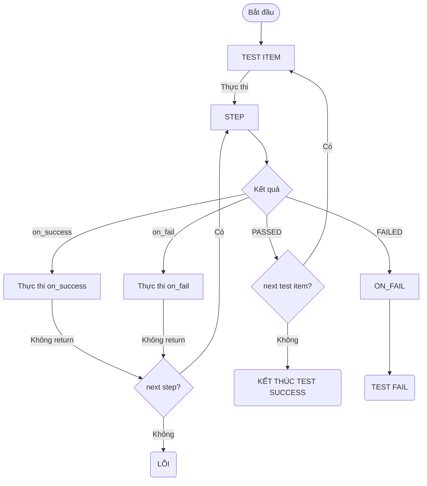

# GIỚI THIỆU
- AUTHOR: Bau.Linh
- Last Updated: 2024-06-10

Đây là tài liệu cung cấp thông tin hướng dẫn về `script.yaml`, bao gồm các định dạng, cấu trúc, thành phần, và cách sử dụng các tính năng như String Resolve, Executer & Method, cũng như xử lý lỗi.

# TỔNG QUAN
`script.yaml` là kịch bản tự động hóa được sử dụng cho chương trình <b>ScriptRunner2.exe</b>
Nó cho phép viết các kịch bản test đơn giản đến phức tạp một cách dễ dàng và hiệu quả.

# MỤC LỤC

| Phần | Tên | Mô Tả |
|------|----------|----------|
| 1    | Định Dạng Chung YAML | Giới thiệu về định dạng chung của file YAML |
| 2    | Cấu Trúc Chung Cho Script.Yaml | Mô tả cấu trúc cơ bản của file script.yaml |
| 3    | Thành Phần | Giải thích các thành phần chính trong script.yaml |
| 4    | String Resolve | Hướng dẫn sử dụng tính năng String Resolve |
| 5    | Executer & Method | Hướng dẫn sử dụng Executer và Method trong script.yaml |
| 6    | Xử Lý Lỗi | Hướng dẫn cách xử lý lỗi

# ĐỊNH DẠNG CHUNG YAML
**DO**:
- Sử dụng dấu cách (space) để thụt lề, không sử dụng tab.
- Sử dụng dấu gạch ngang (-) để liệt kê các mục trong danh sách.
- Sử dụng dấu hai chấm (:) để phân tách khóa và giá trị.
- Giữ nguyên định dạng YAML chuẩn để đảm bảo tính tương thích.
- Sử dụng dấu ngoặc kép ("") hoặc dấu nháy đơn ('') cho các chuỗi có chứa ký tự đặc biệt.
- Các khóa `key` viết dạng `lower_case_with_underscores`.

# CẤU TRÚC CHUNG CHO SCRIPT.YAML
```yaml
script:
  mes_defect_code: ~
  test_environments: ~ 
  test_configurations: ~
  test_sequences: ~
  test_targets: ~    
```
Hướng dẫn:

- `script.yaml` bao gồm một khoá chính `script`, bên trong có các khoá con như sau:
  - `mes_defect_code`: Danh sách mã lỗi MES.
  - `test_environments`: Các môi trường tải xuống từ SFTP.
  - `test_configurations`: Cấu hình test cho các thiết bị.
  - `test_sequences`: Các bước kiểm tra cụ thể.
  - `test_targets`: Các mục tiêu kiểm tra với các model khác nhau.

# THÀNH PHẦN


## `mes_defect_code`
- <b>Mô tả:</b> Danh sách mã lỗi MES cung cấp.
- <b>Type:</b> Mapping (string-string)
- <b>Ví dụ:</b>
```yaml
mes_defect_code:
  <eror_name>: <defect_code> # error_name: tên lỗi của chương trình, defect_code: mã lỗi MES tương ứng
  ERROR_001: OS01
  ERROR_002: OS02

```

## `test_environments`
- <b>Mô tả:</b> Các môi trường tải xuống từ SFTP.
- <b>Type:</b> danh sách object
- <b>Ví dụ:</b>
```yaml
test_environments: 
    - &env
      # những item sẽ được tải xuống.
      # là 1 danh sách object có các trường: name, type, from,  to, extract_to
      # có thể dùng &<name> để tham chiếu
      downloads:
        - name: "vtp" 
          # name: tên hiển thị của item tải về, không ảnh hưởng đến quá trình tải
          type: "folder" # loại tải về: folder, file, compressed
          # type có thể là: folder, file, compressed
          from: "/SFTP.conf.pe.02/V6ENV/vtp_ver24011801" 
          # from: đường dẫn trên server sftp, có thể tuyệt đối hoặc tương đối
          # tuyệt đối dạng: /SFTP.conf.pe.02/V6ENV/vtp_ver24011801
          # tương đối dạng: ./setup/vtp_ver24011801
          # kỹ sư EE sẽ tự verify đường dẫn này trên server sftp.
          to: "./setup/vtp" # đường dẫn lưu trữ trên máy local
          # to: đường dẫn lưu trữ trên máy local. Có thể sử dụng tuyệt đối hoặc tương đối
          # tương đối sẽ lưu vào: {thư mục exe}/setup/{PRODUCT}/{STATION}/{MODEL_ID}/{đường dẫn tương đối}
          extract_to: ~
          # dành cho file nén (compressed).
          # để là null (~). Giải nén vào ./setup/{tên file}
          # đường dẫn tương đối
          # đường dẫn tuyệt đối

        # ví dụ item thứ 2.
        - name: "vtp_env" #  thư mục vtp chỉ chứa file vtp, môi trường vtp nên configure riêng theo từng model
          type: "folder" 
          from: "./setup/VN6301ABAR0B" # đường dẫn tương đối
          to: "./setup/vtp" # đường dẫn lưu trữ trên máy local
          extract_to: ~
```
    
**Cấu trúc chi tiết của `test_environments`:**
| key | kiểu dữ liệu | bắt buộc | cho phép null không | mô tả |
|-----|------|----------|---------------------|-------|
| `test_environments` | danh sách object | không | không | danh sách các môi trường tải xuống từ SFTP |
| `downloads` | danh sách object | không | không | danh sách các mục tải về trong môi trường |
| `name` | string | có | không | tên hiển thị của mục tải về |
| `type` | string | có | không | loại mục tải về: `folder`, `file`, `compressed` |
| `from` | string | có | không | đường dẫn trên server SFTP |
| `to` | string | có | không | đường dẫn lưu trữ trên máy local |
| `extract_to` | string | không | có | đường dẫn giải nén cho file nén (compressed) |

**Bổ xung:**
- Sử dụng `&<name>` để đặt tên cho môi trường.
- `downloads`: về mặt logic, nếu có item này thì phải có ít nhất 1 mục tải về bên trong.
- `name`: tên hiển thị, không ảnh hưởng đến quá trình tải.
- `type`: loại tải về, <b>CHỈ</b>có thể là `folder`, `file`, hoặc `compressed`.
- `from`: đường dẫn trên server SFTP, có thể là tuyệt đối hoặc tương đối.
  - Tuyệt đối, ví dụ: `/SFTP.conf.pe.02/V6ENV/vtp_ver24011801`
  - Tương đối, ví dụ: `./setup/abc`, tương đương: `/SFTP.conf.pe.02/V6/{PRODUC}/{STATION}/setup/abc`
- `to`: đường dẫn lưu trữ trên máy local, có thể là tuyệt đối hoặc tương đối.
  - Tuyệt đối: ví dụ: `D:\Downloads\setup\vtp`, sử dụng `\`.
  - Tương đối: ví dụ: `./setup/vtp`, tương đương: `{thư mục exe}/setup/{PRODUCT}/{STATION}/{MODEL_ID}/setup/vtp`
- `extract_to`: chỉ dành cho `type: compressed`.
  - Nếu để null (~), sẽ giải nén vào `./setup/{tên file}`.
  - Có thể sử dụng đường dẫn tương đối hoặc tuyệt đối.

**Các môi trường đã được setup và có thể dùng chung**:

| Tên môi trường | Đường dẫn | Mô tả |
|----------------|-------|--------------------|
| adb | `/SFTP.conf.pe.02/V6ENV/adb` | Công cụ adb cho việc giao tiếp với thiết bị Android. |
| AtmelSecureAccess tool | `/SFTP.conf.pe.02/V6ENV/AtmelSecureAccess` | Thư viện và công cụ Atmel Secure Access. Dành cho trạm UX100, UX110 OS DL |
| QFIL | `/SFTP.conf.pe.02/V6ENV/qfil_env` | Công cụ QFIL để flash os image cho thiết bị Android. |
| OCR | `/SFTP.conf.pe.02/V6ENV/tessdata` | Thư viện ngôn ngữ cho OCR Tesserect. Dành cho các trạm dùng CAMERA VISION | 
| vtp | `/SFTP.conf.pe.02/V6ENV/vtp_ver24011801` | Chứa tool VTP.exe của khách hàng. Yêu cầu: Cần phải setup thêm môi trường riêng cho từng model (xem ví dụ ở dưới). |


## `test_configurations`
- <b>Mô tả:</b> Các môi trường tải xuống từ SFTP.
- <b>Type:</b> danh sách object
- <b>Ví dụ:</b>
```yaml
script:
  test_configurations: 
    - &t650c_configuration
      flags: ~ 
      script_information: 
        station_name: <tên trạm> # bắt buộc
        description: <mô tả> # bắt buộc
      script_configuration: 
        general: # key-value (string-string), có thể null
          working_dir: "C:\Test\T650C"
        fixture_configuration: # danh sách object, có thể null
          - fixture_1:  # danh sách key-value
            port: "COM3"
            baud_rate: "9600"
          - fixture_2:
            port: "COM4"
            baud_rate: "115200"
```

**Cấu trúc chi tiết của `test_configurations`:**
| key | kiểu dữ liệu | bắt buộc | cho phép null không | mô tả |
|-----|------|----------|---------------------|-------|
| `test_configurations` | danh sách object | có | không | danh sách các cấu hình test |
| `flags` | danh sách `string` | không | có | các cờ tùy chọn cho cấu hình test |
| `script_information` | object | có | không | thông tin về kịch bản test |
| `station_name` | string | có | không | tên trạm kiểm tra |
| `description` | string | có | không | mô tả kịch bản test |
| `script_configuration` | object | có | không | cấu hình chi tiết cho kịch bản test |
| `general` | mapping (string-string) | không | có | cấu hình chung cho kịch bản test |
| `fixture_configuration` | danh sách object | không | có | cấu hình cho các thiết bị kiểm tra (fixture) |

**Bổ xung:**
- Sử dụng `&<name>` để đặt tên cho cấu hình test.
- `flags`: danh sách các cờ tùy chọn, có thể để null.
- các object bên trong `fixture_configuration` có thể có nhiều trường key-value tùy theo từng yêu cầu của kịch bản test. Nhưng <b>PHẢI</b> đồng nhất về cấu trúc giữa các object trong cùng một `fixture_configuration`.

**Các flags có thể sử dụng:**
| Tên cờ | Mô tả |
|---------|-------|
| `enable_camera_window` | Mở cửa sổ dành cho camera. Dùng cho trạm CAMERA VISION |
| `skip_upload_defect_code` | Bỏ qua bước upload mã lỗi lên MES nếu test FAIL. |
| `fixture_control` | Gửi mã fixture_code lên MES. |


## `test_sequences`
- <b>Mô tả:</b> Chứa danh sách các kịch bản cụ thể, mỗi kịch bản là một danh sách `test_item`, mỗi `test_item` có các bước test cụ thể.
- <b>Type:</b> danh sách object
- <b>Ví dụ:</b>
```yaml
test_sequences: 
    - &t650c_test_sequence
      test_items:
        - name: CHECK_MBS_NO 
          lower_limit: ~ 
          upper_limit: ~ 
          steps: 
            - do: mes.CHECK_MBS_NO 
              with: ~
              on_success: ~
              on_fail: ~

        - name: MES_GET_ETH_MAC
          steps: 
            - do: mes.GET_MAC_LIST
              with: ~
              on_success: ~
              on_fail: ~

        - name: PMS_AUTO_TEST
          steps: 
            - do: pms.AUTO
              with:
                working_path: C:\\T650C_SA_K81DL_TOOL20230929\\V1.21.2\PMS_Simulation_Window_V1.09
                exe_name: PMS_Simulation_Window_V1.09.exe
                bt_mac: ~
                wifi_mac: ~
                eth_mac: 123456789012 
              on_success: ~
              on_fail: ~

        - name: MT_AUTO_TEST
          steps: 
            - do: mt.AUTO
              with: 
                working_path: C:\T650C_SA_K81DL_TOOL20230929\V1.21.2
                exe_name: PCBA_tests.exe
                ict_sn_01: $context input_str
                ict_sn_02: ~
              on_success: ~
              on_fail: ~

        - name: CHECK_RESULT
          steps: 
            - do: mt.check_tasklist
              with: 
                board_id: 01
                expect: K81-Firmware,Complete
              on_success: ~ 
              on_fail: 
                - do: return.FAIL
                  with:
                    error_code: DOWNLOAD_K81_FIRMWARE_FAIL
            
            - do: mt.check_tasklist
              with: 
                board_id: 01
                expect: K81-APP,Complete
              on_success: 
                - do: return.PASS
                  with: ~
              on_fail: 
                - do: return.FAIL
                  with:
                    error_code: DOWNLOAD_K81_APP_FAIL
```
**Cấu trúc chi tiết của `test_sequences`:**
| key | kiểu dữ liệu | bắt buộc | cho phép null không | mô tả |
|-----|------|----------|---------------------|-------|
| `test_sequences` | danh sách object | có | không | danh sách các kịch bản test |
| `test_items` | danh sách object | có | không | danh sách các mục kiểm tra trong kịch bản |
| `name` | string | có | không | tên của mục kiểm tra |
| `lower_limit` | string | không | có | giới hạn dưới cho mục kiểm tra |
| `upper_limit` | string | không | có | giới hạn trên cho mục kiểm tra |
| `steps` | danh sách object | có | không | danh sách các bước thực hiện trong mục kiểm tra |
| `do` | string | có | không | hành động cần thực hiện |
| `with` | mapping (string-string) | không | có | tham số truyền vào cho hành động |
| `on_success` | danh sách object | không | có | các hành động khi bước thực hiện thành công |
| `on_fail` | danh sách object | không | có | các hành động khi bước thực hiện thất bại |

**Bổ xung:**
- Sử dụng `&<name>` để đặt tên cho kịch bản test.
- `test_items`: mỗi mục kiểm tra có thể có tên, giới hạn dưới và trên, cùng với các bước thực hiện.
- `do`: cấu trúc của hành động, định dạng là `<executer>.<method>`.
- `with`: tham số truyền vào cho hành động, có thể để null. Hoặc danh sách key-value (string, string) tùy theo `method`.
- `on_success`: khi hành động thành công, sẽ thực hiện các hành động bên trong danh sách này. Nếu để null (~) thì sẽ tiếp tục <b>THỰC HIỆN HÀNH ĐỘNG TIẾP THEO TRONG DANH SÁCH TEST ITEMS, NẾU KHÔNG CÒN HÀNH ĐỘNG NÀO THÌ SẼ BÁO LỖI.</b>
- `on_fail`: khi hành động thất bại, sẽ thực hiện các hành động bên trong danh sách này. Nếu để null (~) thì sẽ tiếp tục <b>THỰC HIỆN HÀNH ĐỘNG TIẾP THEO TRONG DANH SÁCH TEST ITEMS, NẾU KHÔNG CÒN HÀNH ĐỘNG NÀO THÌ SẼ BÁO LỖI.</b>

**Sơ đồ logic thực hiện test_sequences:**



# STRING RESOLVE
- <b>Mô tả:</b> Cung cấp các biến động để sử dụng trong `with`. Cú pháp sử dụng là: `$<key> <value>`
- <b>Ví dụ:</b>
```yaml
- do: logger.info
  with:
    message: $str người dùng đã nhập MBSNO là {$context input_str}
```

**Các biến động có thể sử dụng:**
| Dạng | Mô tả | 
|-----------|-------|
| `$context input_str` | Lấy giá trị `MBSNO`.|
| `$context <key>` | Lấy giá trị biến `key` hiện tại.|
| `$script_config <key>` | Lấy giá trị `key` từ `script_configuration` trong `test_configurations`.|
| `$user_config mes_on` | Lấy chế độ chương trình hiện tại. `True`: PRODUCTION MODE, `False`: OFFLINE MODE.|
| `$if <condition> <toán tử> <giá trị>` | Biểu thức điều kiện if. Trả về True hoặc False. Xem ví dụ bên dưới. |
| `$path <relative_path>` | Lấy đường dẫn tuyệt đối từ đường dẫn tương đối. Ví dụ: `$path ./setup/vtp` sẽ trả về `D:\TestRunner\setup\{PRODUCT}\{STATION}\{MODEL_ID}\setup\vtp` nếu thư mục exe là `D:\TestRunner`. |
| `$func <function_name> <param1> <param2> ...` | Gọi hàm tùy chỉnh đã được định nghĩa trong chương trình. Hàm đang được phát triển. |
| `$str <text>` | Trả về chuỗi text. Dùng để nối chuỗi động. |

**Bổ xung**:
- Biểu thức điều kiện if:
  - Cú pháp: `$if <condition> <toán tử> <giá trị>`
  - `<condition>`: có thể là biến động như `$context input_str`, `$script_config working_dir`, v.v.
  - `<toán tử>`: bao gồm `==`, `!=`, `>`, `<`, `>=`, `<=`.
  - `<giá trị>`: giá trị so sánh, có thể là chuỗi hoặc số.
  - Ví dụ:
    ```yaml
    - do: logger.info
      with:
        message: $if {$context input_str} == 123456 # => message: True nếu input_str là 123456, ngược lại: message: False
    ```

  - Hỗ trợ lồng nhiều biểu thức với nhau, mỗi biểu thức con được bọc trong `{ biểu thức }` . Ví dụ:
   ```yaml
    - do: logger.info
      with:
        message: $str Giá trị imei là { $context MES[imei] }
    ```

# EXECUTER & METHOD
## Mô tả chung
<b>Mô tả:</b> Cung cấp thông tin về các `executer`, `method` và `with` tương ứng có thể sử dụng trong `do`.
<b>Ví dụ:</b>
```yaml
- do: mes.CHECK_MBS_NO
  with: ~
```
**BỔ XUNG - CHÚ Ý**:
- `method` với tên `UPPER_CASE_WITH_UNDERSCORES` là `method` sẽ return về `PASS` hoặc `FAIL`. Các `step` tiếp theo trong cùng `test_item` sẽ bị bỏ qua.
- `method` với tên `lower_case_with_underscores` là `method` không return về `PASS` hoặc `FAIL`. Tùy thuộc kết quả thực thi `method` mà nó sẽ thực hiện `on_success` hoặc `on_fail`. **TUY NHIÊN**, nếu nó xảy ra lỗi thì cũng sẽ return về `FAIL` mà không thực hiện `on_fail`.
- `on_success`, `on_fail` nếu là `~` (null) thì sẽ tiếp tục thực hiện `step` tiếp theo trong cùng `test_item`. Nếu không còn `step` nào thì sẽ báo lỗi.

## Bảng Executer & Method hỗ trợ

| Executer | Method | with | Kết quả | Mô tả | Chú ý |
|----------|--------|------|-------|-------| -------|
| `return` - điều khiển kết quả test | `return.PASS` | `~` | Trả về `PASS` cho `test_item` này, bỏ qua các bước tiếp theo trong `test_item`. | Dùng để kết thúc `test_item` với kết quả `PASS`. | - |
| | `return.FAIL` | - `error_code: <tên lỗi>` | Trả về `FAIL` cho `test_item` này, bỏ qua các bước tiếp theo trong `test_item`. | Dùng để kết thúc `test_item` với kết quả `FAIL` và ghi mã lỗi. | Mã lỗi nên đề là `UPPER_CASE_WITH_UNDERSCORES`. |
| `mes` - giao tiếp với MES | `mes.is_online` | `~` | Chế độ PRODUCTION => `true`, else => `false` | Kiểm tra chế độ của chương trình | - |
| | `mes.CHECK_MBS_NO` | `~` | `PASS` | `FAIL` | Kiểm tra đầu vào MBSNO. Mọi trạm test qua MES đều cần. | Nếu chế độ là OFFLINE => trả về PASS. |
| | `mes.GET_CSN` | `~` | `PASS` \| `FAIL` |Lấy giá trị CSN của MBSNO từ MES và lưu vào `context` với tên `MES[csn]` | Chế độ OFFLINE sẽ lỗi |
| | `mes.GET_CONTROL_TABLE` | `~` | `PASS` \| `FAIL` | Lấy thông tin guankongbiao từ MES và lưu vào `context` lần lượt với tên `MES[<tên biến>]` | Chế độ OFFLINE sẽ lỗi. Liên hệ với MES để lấy các trường thông tin cần thiết. |
| | `mes.GET_MAC_LIST` | `~` | `PASS` \| `FAIL` | Lấy một MAC mới hoặc MAC đã được ghép với MBSNO từ MES và lưu vào `context` với tên `MES[mac]` | Chế độ OFFLINE sẽ lỗi. Dành cho các trạm cần ghi `BT MAC`, `WIFI MAC`, hoặc `ETH MAC` mà cần lấy MAC mới từ MES. | 
| | `mes.GET_NEW_IMEI` | `~` | `PASS` \| `FAIL` | Lấy một IMEI mới từ MES và lưu vào `context` với tên `MES[imei]` | Chế độ OFFLINE sẽ lỗi. Dành cho các trạm cần ghi IMEI mới lấy từ MES. |
| | `mes.UPLOAD_BT_MAC` | - `mac: <MAC>` | `PASS` \| `FAIL` | Upload BT MAC đã ghi lên MES. | Chế độ OFFLINE sẽ lỗi. Dành cho các trạm cần upload BT MAC lên MES. `<MAC>` đã được đọc và lưu vào `context` ở item trước đó. |
| | `mes.UPLOAD_WIFI_MAC` | - `mac: <MAC>` | `PASS` \| `FAIL` | Upload WIFI MAC đã ghi lên MES. | Chế độ OFFLINE sẽ lỗi. Dành cho các trạm cần upload WIFI MAC lên MES. `<MAC>` đã được đọc và lưu vào `context` ở item trước đó. |
| | `mes.UPLOAD_ETH_MAC` | - `mac: <MAC>` | `PASS` \| `FAIL` | Upload ETH MAC đã ghi lên MES. | Chế độ OFFLINE sẽ lỗi. Dành cho các trạm cần upload ETH MAC lên MES. `<MAC>` đã được đọc và lưu vào `context` ở item trước đó. |


# XỬ LÝ LỖI